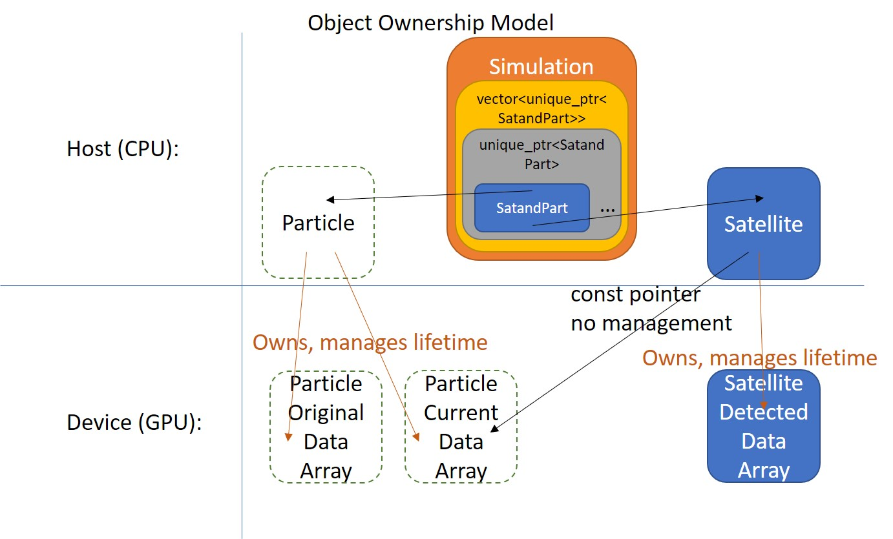

# Satellite





### What is?
**`Satellite(double altitude, bool upwardFacing, int numberOfAttributes, long numberOfParticles, double** partDataGPUPtr, std::string name = "Satellite")`**

Satellite is a class responsible for checking whether or not a particle has passed a certain altitude.  It faces its detecter *either* up *or* down, *not* both and captures 2pi sr (upper hemisphere or lower hemisphere) of an imaginary sphere surrounding the satellite.  If both directions of detection is desired at an altitude, two satellites are required.  Modifying to account for real-world limited FOV of an actual detector may be necessary when comparing with real-world data.

*Note: Altitude is in **_s_** - distance along a field line from the surface of the Earth, **_not_** **_r_** - the straight-line distance to the center of the Earth, or the traditional sense of **_altitude_** - the shortest straight-line distance to the surface of the Earth.*


### Use
After creating a [Simulation](./../Simulation/README.md), use the function `Simulation::createTempSat` directly or use the [API function](./../API/README.md) `createSatelliteAPI` to create a (or several) Satellite(s).  The [Simulation](./../Simulation/README.md) will manage the lifetime of the Satellite(s) and run the detection kernel at the appropriate time, as well as save data to disk automatically.  See [Simulation](./../Simulation/README.md) for the saved data structure.


### How created? (under the hood)
```
class Simulation {
protected:
	struct TempSat
	{//Struct that holds data to create satellite - allows satellites to be created before particles through API
		int particleInd;
		double altitude;
		bool upwardFacing;
		std::string name;
		/*
		   ...
		*/
	};

	struct SatandPart
	{//Satellite needs particle-specific data associated with it, so this struct holds a shared_ptr to the particle
		std::unique_ptr<Satellite> satellite;
		std::shared_ptr<Particle>  particle;
		/*
		   ...
		*/
	};
	/*
	   ...
	*/
};
```
`Simulation::createTempSat` and `createSatelliteAPI` create a `struct TempSat` which stores the data necessary to create the Satellite later on.  Once `Simulation::initializeSimulation` is called, `TempSats` are converted to `SatandParts`.  A struct to hold a pointer to both a Satellite and a [Particle](./../Particle/README.md) is necessary, because there are many times where modifying or understanding the data of a Satellite requires knowing various attributes about the associated [Particle](./../Particle/README.md) (ex: mass).  As you can guess, `TempSat.particleInd` must be a valid index to a [Particle](./../Particle/README.md) before calling `Simulation::initializeSimulation` or an exception will be thrown in that function.  It's ok if the [Particles](./../Particle/README.md) are created after the `TempSat` (and is the reason `TempSat` exists - to allow the user to create things in any order they want, as long as everything is created before `Simulation::initializeSimulation`).


### Public Member Functions
```
virtual void iterateDetector(double simtime, double dt, int blockSize)
```
Iterates the detector (a CUDA kernel that checks if a particle has passed this Satellite instance's altitude).  This is called automatically by the owning [Simulation](./../Simulation/README.md) instance (specifically `Simulation::iterateSimulation`).


```
virtual void copyDataToHost()
```
Copies data to host (CPU) from device (GPU).  2D data from GPU is `push_back`ed into `data_m`, representing something analogous to a recorded "measurement" (or a set of them).  Also clears the GPU memory, setting it to zero (but does *not* call cudaFree, so the memory remains allocated).  Again, this is called by the owning [Simulation](./../Simulation/README.md) instance (specifically `Simulation::iterateSimulation`).


```
virtual void freeGPUMemory()
```
Calls `cudaFree(memptr)` on the device memory allocated by the Satellite instance.  Called by `Simulation::freeGPUMemory`.  Beware that once freed, there is no interface for reallocating device memory.  Another new (or existing) instance will have to be used if `Simulation::iterateSimulation` is called again (and this instance will have to be destroyed, or `iterateDetector` will be called on it leading to an invalid (device) memory access, because it has been freed).


```
virtual void saveDataToDisk(std::string folder, std::vector<std::string> attrNames)
```
Calls `getConsolidatedData` with `removeZeros = true` and saves the data to disk.  This is also called automatically by `Simulation::iterateSimulation` once iterations are complete.


```
virtual void loadDataFromDisk(std::string folder, std::vector<std::string> attrNames)
```
Reads '.bin' files from disk at `folder/[name_m]_[attrName].bin`.  This is called from `Simulation::previousSimulation` to reconstruct the state of Satellites (as well as other classes) from a previous run so the user can interact with the data.  This can also be called directly by `Simulation::satellite(index)->loadDataFromDisk`.


```
std::vector<std::vector<double>> getConsolidatedData(bool removeZeros)
```
Calls `callDataToHost`, if necessary, (`iterateDetector` has been called since `copyDataToHost` was called last).  Iterates over the outer dimension of `data_m` (representing different "measurements", see `copyDataToHost`) and flattens to a 2D array, removing zeroes from the array if `removeZeros` is `true`.


```
const std::vector<std::vector<std::vector<double>>>& data() { return data_m; }
int     getNumberOfAttributes() { return numberOfAttributes_m; }
long    getNumberOfParticles() { return numberOfParticles_m; }
double  altitude() { return altitude_m; }
bool	upward() { return upwardFacing_m; }
std::string name() { return name_m; }
```
Various access functions that return exactly what they say.


[Up a level](./../README.md)