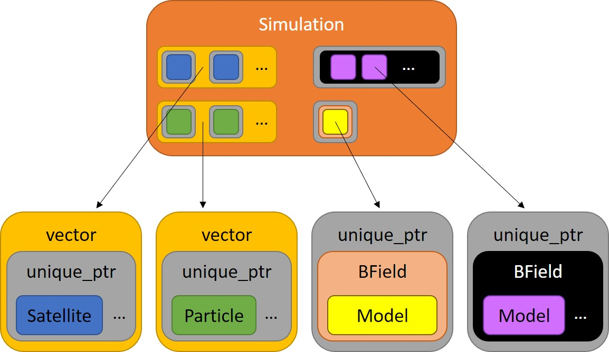

# Simulation





### What is?
**`Simulation(double dt, double simMin, double simMax, std::string saveRootDir)`**

Simulation is a container class that integrates functionality from: [Particle](./../Particle/README.md), [Satellite](./../Satellite/README.md), [BField](./../BField/README.md) derived models, [EField](./../EField/README.md) derived models, and [LogFile](./../LogFile/README.md), managing the lifetime of instances through the use of smart pointers (with the exception of through the extern c API).  Simulation also contains the CUDA code that runs the core of the simulation (Fourth Order Runge Kutta, equation of motion, and a container function that manages early exiting (if the particle is not in simulation).  From outside C++, can be manipulated by numerous [API functions](./../API/README.md), including `createSimulationAPI` and `terminateSimulationAPI` as examples.

*Note: In this documentation, uppercase (and usually linked) names refer to classes, while lowercase names refer to non-class things.  For example: [Particle](Particle/README.md) refers to the class itself or an instance of the class which manages a large number of particles (lowercase).  particle(s) usually refers to a collection of attributes (ex: v_para, v_perp or mu, and s, as well as maybe time, index, etc) that represents a `real-world physical particle`.*


### Use
Create a Simulation through the [API function](./../API/README.md) `createSimulationAPI` or with `std::make_unique<Simulation>(...)`.  `dt` is self-explanatory, `simMin` and `simMax` refer to the min and max limits of the simulation - if a particle is found outside this, it is ignored, and `saveRootDir` refers to the directory where you want data saved.  Data is saved in the following way (and relies on this folder structure existing prior to saving):
```
.
|- _chars : Simulation characteristics in '.bin' and '.txt' files for later loading
|- bins : stores binary '.bin' files containing various data
|  |- particles_final : final particle data at the end of iteration
|  |- particles_init : initial particle data before iterating
|  ∟- satellites : compressed (zeroes removed) captured satellite data for later processing
```


### Public Member Functions
```
const std::vector<std::vector<double>>& Simulation::getParticleData(int partInd, bool originalData)
```
Return a const reference to a [Particle's](./../Particle/README.md) data array, whose index is specified by partInd.  Dimensions represent [attribute][particle].  The boolean "originalData" determines whether the original data array or current data array is returned.  See [Particle's readme](./../Particle/README.md) for more details about original vs current data.  From outside C++, accessed through `getPointerToParticleAttributeArrayAPI` [API function](./../API/README.md).


```
const std::vector<std::vector<std::vector<double>>>& Simulation::getSatelliteData(int satInd)
```
Return a const reference to satInd index [Satellite's](./../Satellite/README.md) data array.  Dimensions represent [measurement][attribute][particle].  See [Satellite's readme](./../Satellite/README.md) for more info.  From outside C++, accessed through `getSatelliteDataPointersAPI` [API function](./../API/README.md).


```
void Simulation::createParticleType(std::string name, std::vector<std::string> attrNames, double mass, double charge, long numParts, int posDims, int velDims, double normFactor, std::string loadFilesDir)
```
Create a particle type with specified name, attributes, etc.  Attributes refer to position dimension name, velocity dimension name, or some other thing such as time, index, or other label.  These labels will be used to save/load data to/from disk.  Save/load format is "[name]_[attr].bin".  If loadFilesDir does not equal "", data is loaded from the specified folder.  Exception is thrown if files don't exist according to attributes and name specified.  From outside C++, accessed through `createParticleTypeAPI` [API function](./../API/README.md).


```
void Simulation::createTempSat(int partInd, double altitude, bool upwardFacing, std::string name)
```
Used to create a [Satellite](./../Satellite/README.md).  The actual instance is created immediately before iterating the simulation.  In this sim, altitude is in "s" - the distance along the field line, NOT "r" - the distance from the center of the Earth, or the tradition sense of altitude - the distance from the surface of the Earth.  From outside C++, accessed through `createSatelliteAPI` [API function](./../API/README.md).


```
void Simulation::setBFieldModel(std::string name, std::vector<double> args, bool save)
```
Creates a [BField](./../BField/README.md) model, depending on the user's specification.  Currently available models for `name` are "DipoleB" and "DipoleBLUT".  See previous documentation link for more info on the various models.  From outside C++, accessed through `setBFieldModelAPI` [API function](./../API/README.md).


```
void Simulation::addEFieldModel(std::string name, std::vector<std::vector<double>> args)
```
Creates a [EField](./../EField/README.md) model, depending on the user's specification.  Currently available models for `name` are "QSPS" and "AlfvenLUT" (not quite complete yet).  See previous documentation link for more info on the various models.  No API function to access outside of C++ (yet :)).


```
virtual void saveDataToDisk()
```
Calls saveDataToDisk of [Particles](./Particle/README.md) and [Satellites](./Satellite/README.md).  Called automatically by `iterateSimulation` once iterations are complete.


```
void Simulation::resetSimulation(bool fields)
```
Destroys [Satellites](./../Satellite/README.md) and [Particles](./../Particle/README.md), as well as [BField](./../BField/README.md) model, and [EField](./../EField/README.md) model(s) if `fields` is `True`.  Used to reset the simulation without having to destroy the entire instance of this class and associated data.  This is useful when, for example, generating a backscatter distribution and rerunning to add to the prior data.


```
void Simulation::initializeSimulation()
```
Sets up simulation and prepares for iteration.  Converts TempSats to [Satellites](./../Satellite/README.md) (technically SatandParts).  Saves Simulation attributes, [Particles](./../Particle/README.md), [Satellites](./../Satellite/README.md), and [B](./../BField/README.md)/[E](./../EField/README.md) Field model data to disk.  From outside C++, accessed through `initializeSimulationAPI` [API function](./../API/README.md).


```
void Simulation::iterateSimulation(int numberOfIterations, int checkDoneEvery)
```
Iterate all particles in simulation through [B](./../BField/README.md)/[E](./../EField/README.md) Field models for specified number of iterations.  Simulation checks to see if any particles are left in simulation every checkDoneEvery iterations.  Also manages copying data to GPU at the start, converting vperp<>mu, and copying back to host once complete.  From outside C++, accessed through `iterateSimulationAPI` [API function](./../API/README.md).


```
void Simulation::freeGPUMemory()
```
Call if freeing GPU memory is desired prior to destructors being called (classes all free their own GPU memory on destruction).  Keep in mind that once this happens, you won't be able to use on GPU memory for [Particles](./../Particle/README.md) and [Satellites](./../Satellite/README.md) unless you destroy them and create new ones.  At this time, there is no function to reallocate GPU memory from these classes once destroyed (it is automatically created upon initialization).  From outside c++, accessed through `freeGPUMemoryAPI` [API function](./../API/README.md).


```
double	    simtime(){ return simTime_m; }
double	    dt()     { return dt_m; }
double      simMin() { return simMin_m; }
double      simMax() { return simMax_m; }
size_t      getNumberOfParticleTypes()         { return particles_m.size(); }
size_t      getNumberOfSatellites()            { return satellites_m.size(); }
size_t      getNumberOfParticles(int partInd)  { return particles_m.at(partInd)->getNumberOfParticles(); }
size_t      getNumberOfAttributes(int partInd) { return particles_m.at(partInd)->getNumberOfAttributes(); }
std::string getParticleName(int partInd)       { return particles_m.at(partInd)->name(); }
std::string getSatelliteName(int satInd)       { return satellites_m.at(satInd)->satellite->name(); }
LogFile*    log()                 { return logFile_m.get(); }
Particle*   particle(int partInd) { return particles_m.at(partInd).get(); }
Satellite*  satellite(int satInd) { return satellites_m.at(satInd)->satellite.get(); }
const virtual std::vector<std::vector<double>>&       getParticleData(int partInd, bool originalData);
const virtual std::vector<std::vector<std::vector<double>>>&  getSatelliteData(int satInd);
```
Various access functions with self-explanatory return values.


### CUDA Kernels
```
__global__ void computeKernel(double** currData_d, BField** bfield, EField** efield,
	const double simtime, const double dt, const double mass, const double charge, const double simMin, const double simMax, bool* simDone, const int iter, const int dstep_abort)
```
Global kernel that manages the calculation of the equation of motion (through Fourth Order Runge Kutta), as well as returning early if the particle is outside simulation, and checking if all particles have escaped.  simMin/simMax refer to the min/max s boundaries; iter is the current iteration of loop; dstep_abort is how often to check if all particles have escaped the simulation.   All pointers are to on GPU data/class instances.


```
__global__ void vperpMuConvert(double** dataToConvert, BField** bfield, double mass, double* time, bool vperpToMu)
```
Global kernel that converts vperp<>mu.  All pointers are to on GPU data/class instances.  If time is irrelevant to the B Field (usually is), pass in a nullptr.


Device kernels (foRungeKuttaCUDA and accel1dCUDA) are not documented - you can't call these anyway.


### Protected Member Structs and Data
```
protected:
struct TempSat
{
     int particleInd;
	 double altitude;
	 bool upwardFacing;
	 std::string name;
	 /*
	   ...
	 */
}
```
Stores data necessary to create a [Satellite](./../Satellite/README.md).  This is necessary because creating a [Satellite](./../Satellite/README.md) requires the associated particle to already be created.  This temporary data holder allows satellites to be specified first.  **This is created through the** `Simulation::createTempSat` **member function and** `createSatelliteAPI` **API function and will never need to be accessed directly.**


```
protected:
struct SatandPart
{
	std::unique_ptr<Satellite> satellite;
	std::shared_ptr<Particle>  particle;
	/*
	   ...
	*/
}	
```
Stores smart pointers to [Satellite](./../Satellite/README.md) instance and associated [Particle](./../Particle/README.md).  This oddity is unfortunately necessary due to the fact that [Particle](./../Particle/README.md) data is inseparably tied to [Satellite](./../Satellite/README.md).  **This will never have to be created manually.  Lifetime (including creation) is managed by Simulation.**


**_Other protected data and functions not documented._**


[Up a level](./../README.md)